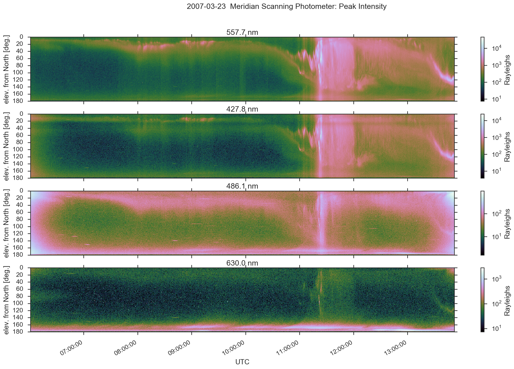

# Digital Meridian Spectrometer

[](https://doi.org/10.5281/zenodo.167565)
[](https://github.com/space-physics/digital-meridian-spectrometer/actions/workflows/ci.yml)
[](http://pepy.tech/project/dmsp)

For Geophysical Institute's Poker Flat Digital Meridian Spectrometer, which uses NetCDF



This library is also usable from Matlab, as seen in `dmsp.m`.

## Data sources

* 2011-present: ftp://optics.gi.alaska.edu/PKR/DMSP/NCDF/
* 1983-2010 (NetCDF 3 .PF files): http://optics.gi.alaska.edu/realtime/data/msp/pkr   This link was good for years and we used this data, but in late 2018 it stopped working.
* [other dates](http://optics.gi.alaska.edu/realtime/data/archive/PKR_MSP_X/)
* FTP: ftp://optics.gi.alaska.edu/PKR/DMSP

Install:

```sh
python -m pip install -e .
```

[LoadMSPdata.py](./LoadMSPdata.py) creates many plots.

Use as a Python module:

```python
import dmsp

dat = dmsp.load('~/data/myfile.PF')
```

which returns [xarray.Dataset](https://docs.xarray.dev/en/stable/generated/xarray.Dataset.html)
