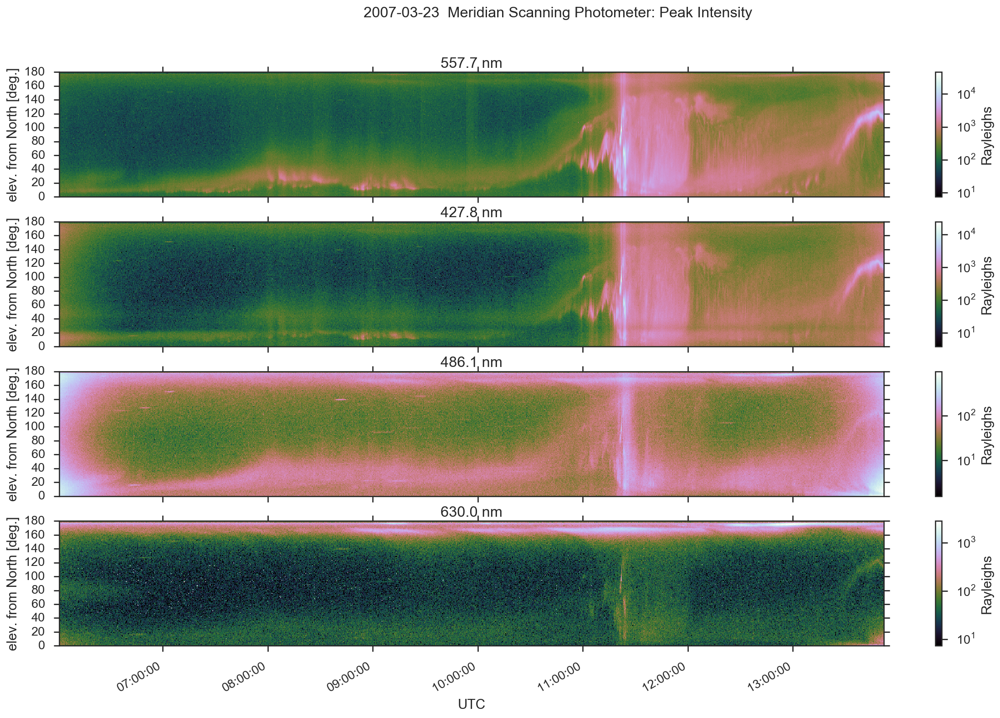

[](https://doi.org/10.5281/zenodo.167565)
[](https://travis-ci.org/scivision/digital-meridian-spectrometer)
[](https://coveralls.io/github/scivision/digital-meridian-spectrometer?branch=master)
[](https://ci.appveyor.com/project/scivision/digital-meridian-spectrometer)


## Digital Meridian Spectrometer

For Geophysical Institute's Poker Flat Digital Meridian Spectrometer, which uses NetCDF



This library is also usable from Matlab, as seen in `dmsp.m`.


## Data sources

* 2011-present: ftp://optics.gi.alaska.edu/PKR/DMSP/NCDF/
* [1983-2010 (NetCDF 3 .PF files)](http://optics.gi.alaska.edu/realtime/data/msp/pkr)
* [other dates](http://optics.gi.alaska.edu/realtime/data/archive/PKR_MSP_X/)


## Install

```sh
python -m pip install -e .
```

### Matlab
Matlab users need:
* Matlab &ge; R2018b
* `dmsp` package installed into the [Python environment associated with Matlab](https://www.scivision.co/matlab-python-user-module-import/#switching-python-version)

## Usage

`LoadMSPdata.py` creates many plots.

Use as a Python module is like:
```python
import dmsp

dat = dmsp.load('~/data/myfile.PF')
```
which returns [xarray.Dataset](http://xarray.pydata.org/en/stable/generated/xarray.Dataset.html)

## Notes

You can also graphically browse the files with the `ncview` program:
```sh
apt install ncview
```

### Error: libnetcdf.so.7

if you get

> ImportError: libnetcdf.so.7: cannot open shared object file: No such file or directory

try:
```sh
apt install libnetcdf-dev
python -m pip install netcdf4
```
or
```sh
conda install netcdf4
```
